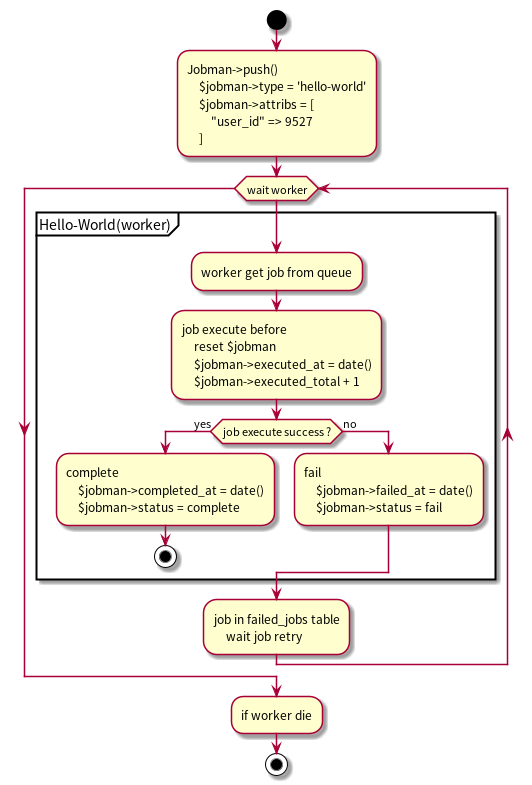

## Jobman
- horizon + dispatch jobs

### Jobman flow  
1. 產生一個需要進入 queue 的 'hello' 工作, 準備好該內容
1. 建立資料 type=hello, attribs={json...} 到 'jobmans' table
1. job 可能會因為失敗而執行多次, jobmans table 只會留下一部份的足跡
1. 如果你有開啟 worker server, 那麼工作就會進入 jobman flow

### Jobman flow picture


### laravel table
- 用到 laravel 提供的 "failed_jobs" table, 該程式會建立這些 tables

### dependency
- redis
- laravel horizon package
- laravel horizon config file
- database: laravel table "failed_jobs"

### enable horizon 
```
# 參數 --environment=local 的使用情況非常不穩定, 不使用 at laravel 5.8.26
php artisan horizon 
google-chrome http://127.0.0.1:8000/horizon/dashboard
```

### 查看現在的情況
```
php artisan horizon:status
php artisan horizon:list
```

### 修正程式後, 重試失敗的 job
```
php artisan horizon:terminate   # 修正程式後, 要重新啟動
php artisan horizon             # 如果有建立並且啟用 supervisor, 消失時會自動啟動
php artisan queue:retry 5       # "failed_jobs" table "id" field
php artisan queue:retry all
```

### 如何建立一個新的 job
1. 參考程式 src/Jobs/HelloWorldJob.php
1. 建立程式 job 在任意的路徑
1. 新增設定 config/jobman.php
1. 新增設定 config/horizon.php
1. 重新執行 php artisan horizon
1. 重新啟動 supervisor (option)
1. trigger your code, 參考 src/Console/Commands/TryHelloCommand.php

### jobmans 部份的欄位說明
- attribs
    - 傳遞 job 需要的訊息
    - 有些 job 需要返還值, 也可以回存在這裡
- logs
    - 希望在 job 裡面留下操作的記錄
    - 這些記錄是發生問題才需要查看
    - 所以不希望留在 laravel.log
    - 可以記在這裡
- error_message
    - 保留最後一次的 $exception->getMessage()
- exception
    - 保留最後一次的 Exception
- failed_at
    - 如果曾經失敗過, 在成功之後, 還是會保留該值
- completed_at
    - 完成任務, 但不代表結果是正確的, 有些結果不是只有一種
- completed_code
    - 通常是 null
    - 如果結果不是只有一種, 可以存在這裡
    - 例如
        - 將資料加到資料庫, 但是該資料已存在, 但是這兩種情況都符合 job 之目的
            - success
            - already-exists
        - 非同步的方式刪除一個 blog, 如果不存在, 就結束工作
            - success
            - blog-not-found

### 應做未做的部份
- 超過 6 個月的資料可以刪除
    - SELECT * FROM `jobmans` WHERE created_at < DATE_SUB(NOW(), INTERVAL 180 DAY);

- 未加入 queue 的 Jobman
    - Jobman push() 的時候如果沒有開啟 redis
    - 那麼這些 jobmans 將永遠不會被執行到
    - 建立一個 console command 將這些 jobman 丟到 redis
    - 該功能一方面也可以再次執行 jobman
